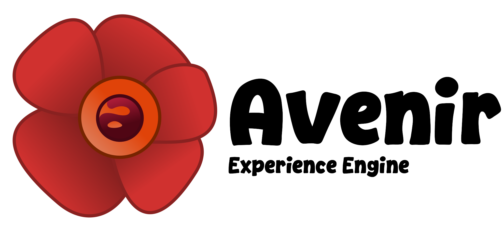
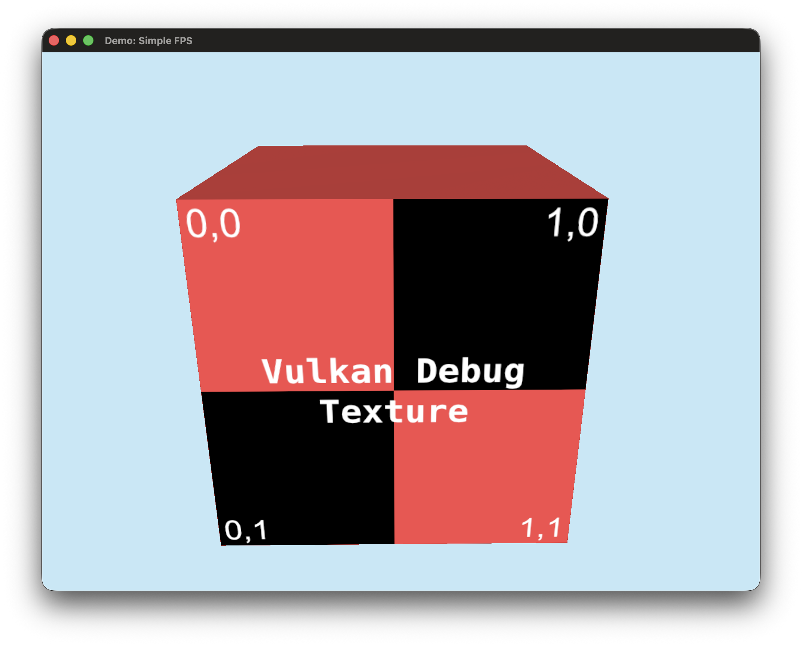
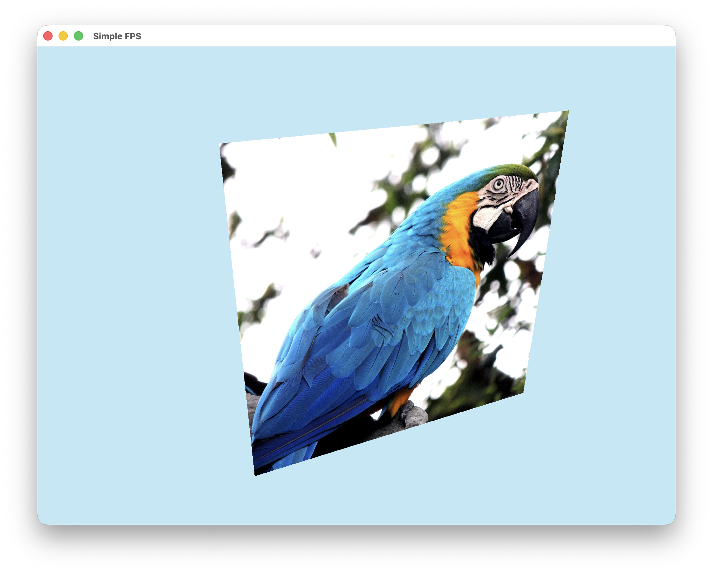

# Avenir



# Introduction

Avenir is a cross-platform, next generation experience engine. It is written in C++20, targeting Vulkan as its default
backend[^1] and exposes a standard .NET (C#) scripting API, allowing a developer to write their title's core gameplay
and rendering systems in fast C++ and users to create content (in the form of extensions) using safely managed, yet
performant C# scripts.

# Features

- Natively supports all modern operating systems[^2]
- Clean, low-cost abstraction over system-level APIs
- Ability to include C# user-extended code scripting
- First-class support for Slang shaders
- ...and more to come!

# Building from source

## Prerequisites

- C++ Compiler (Tested with GCC, Clang and MSVC)
- [CMake](https://cmake.org/download/)
- [Vulkan SDK](https://vulkan.lunarg.com/sdk/home)

## Compiling

```shell
# Inside avenir-engine/ (top-level directory)
mkdir build && cd build
```

```shell
# Configure cmake (optionally generate an IDE-specific project)
cmake ..
```

```shell
cmake --build . --config Release
```

# Screenshots




# Contributing

If you are wanting to contribute please feel free to reach out and create a pull request!

# Credits

- [GLFW](https://github.com/glfw/glfw)
- [GLM](https://github.com/g-truc/glm)
- [stb_image](https://github.com/nothings/stb/tree/master)

[^1]: There are plans for adding multiple backends in the future (e.g., Direct3D and Metal) and as Avenir currently
stands, it already has the abstraction infrastructure to allow easily switching backends.

[^2]: Windows, macOS (through MoltenVK) and Linux